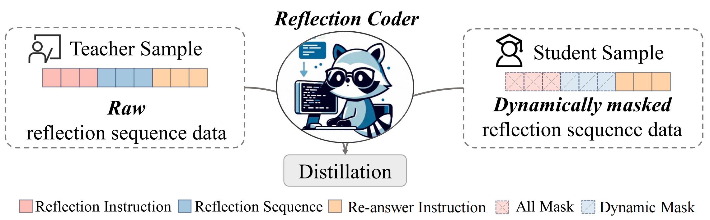

## ReflectionCoder: Learning from Reflection Sequence for Enhanced One-off Code Generation

<p align="center">
    <a href="https://arxiv.org/abs/2405.17057">📄 Paper</a> •
    <a href="https://github.com/SenseLLM/ReflectionCoder">🏠 Repo</a> •
    <a href="https://huggingface.co/SenseLLM/ReflectionCoder-DS-33B">🤖 Models</a> •
    <a href="https://huggingface.co/datasets/SenseLLM/ReflectionSeq-GPT">📚 Datasets </a>
</p>

## Introduction
ReflectionCoder is a novel approach that effectively leverages reflection sequences constructed by integrating compiler feedback to improve one-off code generation performance. Please refer to our paper for more details!



<hr>

## Models

| Model | Checkpoint | Size | HumanEval (+) | MBPP (+) | License|
|:-------|:------------|:------|:---------------|:----------|:--------|
| ReflectionCoder-CL-7B   | 🤗 [HF Link](https://huggingface.co/SenseLLM/ReflectionCoder-CL-7B) | 7B   | 75.0 (68.9)     | 72.2 (61.4)     | [Llama2](https://ai.meta.com/llama/license/) |
| ReflectionCoder-CL-34B  | 🤗 [HF Link](https://huggingface.co/SenseLLM/ReflectionCoder-CL-34B) | 34B  | 70.7 (66.5)     | 68.4 (56.6)     | [Llama2](https://ai.meta.com/llama/license/) |
| ReflectionCoder-DS-6.7B | 🤗 [HF Link](https://huggingface.co/SenseLLM/ReflectionCoder-DS-6.7B) | 6.7B | 80.5 (74.4)     | 81.5 (69.6)     | [DeepSeek](https://github.com/deepseek-ai/DeepSeek-Coder/blob/main/LICENSE-MODEL) |
| ReflectionCoder-DS-33B  | 🤗 [HF Link](https://huggingface.co/SenseLLM/ReflectionCoder-DS-33B) | 33B  | 82.9 (76.8) | 84.1 (72.0) | [DeepSeek](https://github.com/deepseek-ai/DeepSeek-Coder/blob/main/LICENSE-MODEL) |

## Datasets

| Dataset           | Link           | License                                      |
|:-------------------|:----------------|:----------------------------------------------|
| ReflectionSeq-GPT | 🤗 [HF Link](https://huggingface.co/datasets/SenseLLM/ReflectionSeq-GPT) | [License](LICENSE) |
| ReflectionSeq-DS  | 🤗 [HF Link](https://huggingface.co/datasets/SenseLLM/ReflectionSeq-DS) | [License](LICENSE) |

## Training and Evalutation

### Download Data

```bash
python data/download.py
```

### Excepted File Tree

```
data
  - train
    - code_instruct.jsonl
    - reflection_ds.jsonl
    - reflection_gpt.jsonl
```

### Train Script

You can use the following command to fine-tune your model with our method. Here, we assume you have 16 GPUs and set `gradient_accumulation_steps` as 32. You can adjust `gradient_accumulation_steps` based on your number of GPUs to ensure `train_batch_size` is equal to 512.

```bash
RANK=...
MASTER_ADDR=...
MASTER_PORT=...
WORLD_SIZE=...

model_cfg=meta-llama/CodeLlama-7b-Python-hf
out_dir=runs/relfection_coder_code_llama_7b

torchrun --node_rank ${RANK} --master_addr ${MASTER_ADDR} --master_port ${MASTER_PORT} --nnodes ${WORLD_SIZE} --nproc_per_node 8 train.py --deepspeed config/stage_1.json --learning_rate 5e-5 --lr_scheduler_type cosine --per_device_train_batch_size 1 --max_len 4096 --save_steps 100 --warmup_ratio 0.05 --logging_steps 10 --seed 3407 --num_train_epochs 2 --report_to tensorboard --remove_unused_columns false --bf16 --do_train --save_safetensors --save_only_model --gradient_checkpointing --train_file data/train/code_instruct.jsonl data/train/reflection_gpt.jsonl data/train/reflection_ds.jsonl data/train/reflection_gpt.jsonl data/train/reflection_ds.jsonl --logit --block_mask --block_order tce --model_cfg ${model_cfg} --output_dir ${out_dir} --gradient_accumulation_steps 32
```

### Test Script

```bash
out_dir=runs/relfection_coder_code_llama_7b/checkpoint-final

python test.py -tp 2 -p ${out_dir} -t humaneval mbpp multiple
```

Then, use [EvalPlus](https://github.com/evalplus/evalplus) to evaluate the inference results. Note that you should install the nightly version of EvalPlus with `pip install "git+https://github.com/evalplus/evalplus.git" --upgrade`.

```bash
out_dir=runs/relfection_coder_code_llama_7b/checkpoint-final

evalplus.evaluate --dataset humaneval --samples ${out_dir}/results/humaneval.jsonl
evalplus.evaluate --dataset mbpp --samples ${out_dir}/results/mbpp.jsonl
```

We also provide generated results for HuamnEval and MBPP in `data`.

For multiple, you can use [bigcode-evaluation-harness](https://github.com/bigcode-project/bigcode-evaluation-harness) to evaluate the inference results. For example, you can evaluate java with the following command:
```bash
out_dir=.../runs/relfection_coder_code_llama_7b/checkpoint-final

cd .../bigcode-evaluation-harness

python3 main.py \
  --model relfection_coder_code_llama_7b \
  --tasks multiple-java \
  --allow_code_execution \
  --load_generations_path ${out_dir}/results/multiple_java.json \
  --metric_output_path ${out_dir}/results/multiple_java_result.json 
```

When testing MultiPL-E, there are two things to pay attention to:

1. For JAVA, there are a wrong parameter in the testing code, you need replace `result = run(["java", "-ea", "-cp", f"{outdir}", "Problem"], env=sys_env)` to `result = run(["java", "-ea", "-cp", f"{outdir}:{javatuples_path}", "Problem"], env=sys_env)` in `bigcode_eval/tasks/custom_metrics/multiple_metrics/eval_java.py`. Note that, for fair comparsion, we only fix the bug when evaluating DeepSeek-Coder, and use the original code when evaluating Code LLama.
2. For C-Sharp, the testing code in [nuprl/MultiPL-E](https://huggingface.co/datasets/nuprl/MultiPL-E) have some bugs, please use `https://github.com/deepseek-ai/DeepSeek-Coder/blob/main/Evaluation/HumanEval/data/humaneval-cs-bu.jsonl`.

## Citation

If you find this repo useful for your research, please kindly cite our paper:
```
@misc{ren2024reflectioncoder,
    title={ReflectionCoder: Learning from Reflection Sequence for Enhanced One-off Code Generation}, 
    author={Houxing Ren and Mingjie Zhan and Zhongyuan Wu and Aojun Zhou and Junting Pan and Hongsheng Li},
    year={2024},
    eprint={2405.17057},
    archivePrefix={arXiv},
    primaryClass={cs.CL}
}
```

## Acknowledgments

We thank the following amazing projects that truly inspired us:

- [CodeLlama](https://ai.meta.com/research/publications/code-llama-open-foundation-models-for-code/)
- [DeepSeek-Coder](https://github.com/deepseek-ai/DeepSeek-Coder)
- [WizardCoder](https://github.com/nlpxucan/WizardLM/tree/main/WizardCoder)
- [Evol-CodeAlpaca-v1](https://huggingface.co/datasets/theblackcat102/evol-codealpaca-v1)
- [MagiCoder](https://github.com/ise-uiuc/magicoder/tree/main)
- [EvalPlus](https://github.com/evalplus/evalplus)
- [OpenCoderInterpreter](https://github.com/OpenCodeInterpreter/OpenCodeInterpreter/tree/main)
